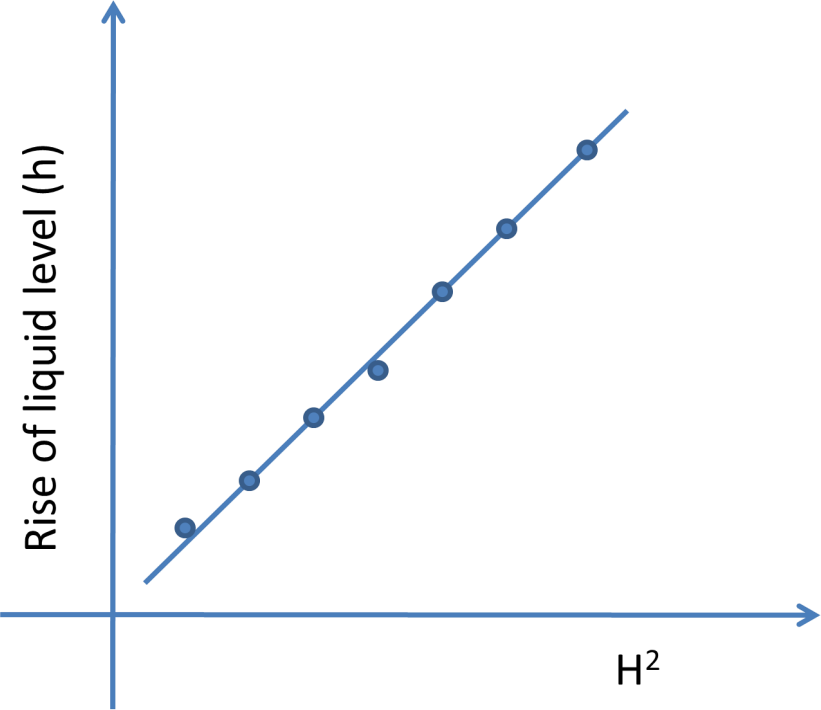
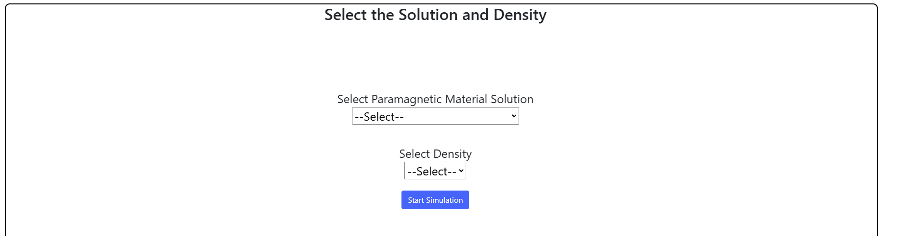
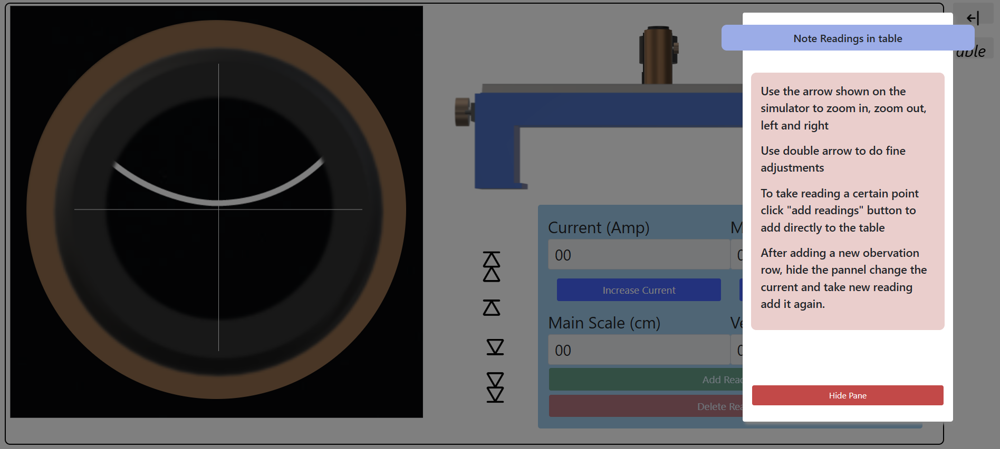
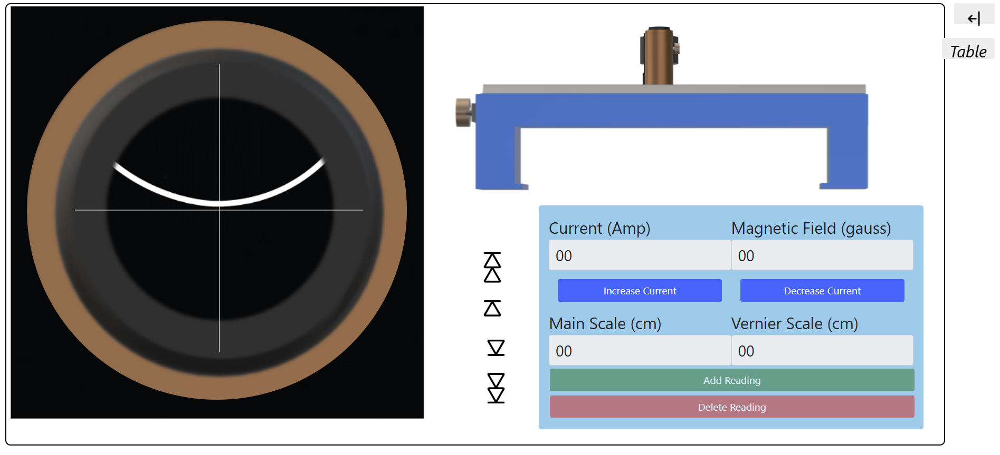
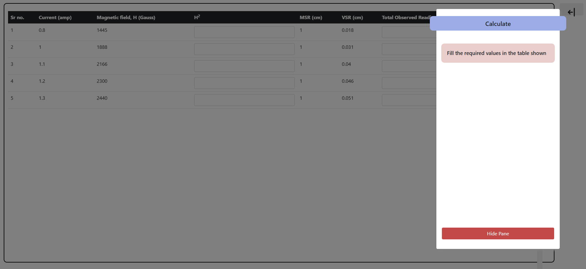
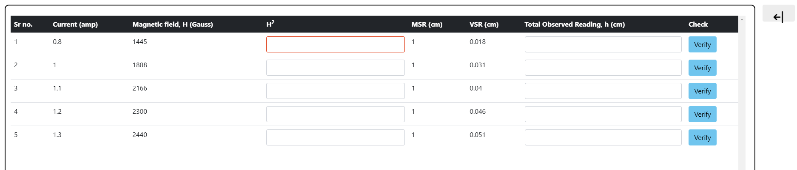
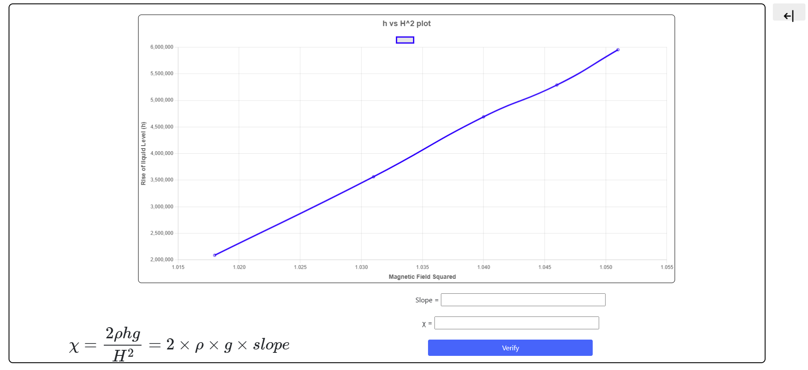

<h2>Procedure: </h2>
<ol>
  <li>Put the tube on stand and fix it with clamp.</li>
  <li>Insert the narrow limb of the Quincke's tube vertically between the pole pieces of the electromagnet such that the meniscus is in the central region of the uniform magnetic field or in the center of the poles, and the wide limb is placed outside the field as shown in the experimental setup diagram.</li>
  <li>Illuminate the meniscus level with an ordinary bulb and view it with a travelling microscope. Adjust the horizontal cross wire of the eyepiece of the microscope on the meniscus and note this reading of the microscope. It will be the initial position of the meniscus. Record this reading in the table as shown below.</li>
  <li>Switch ON the electromagnet power supply and adjust the current, say at 0 amp. Bring the cross wire again on the meniscus and also record this reading in the table by moving the microscope downwards.</li>
  <li>Increase the power supply current in steps of 0.5 amp, i.e., say 0.5, 1.0, 1.5, ....3.0, and note the corresponding position of the level of the liquid. Note all these readings in the table.</li>
  <li>Repeat the experiment for different concentrations of the solution.</li>
  <li>Finally, put the magnetic field sensor between the pole pieces. Switch on the gauss meter and read the magnetic field corresponding to each value of current & note it in the table.</li>
</ol>

Determination of density <i>&rho;</i>:

<ul>
  <li>Mass of specific gravity bottle = <i>W1</i></li>
  <li>Mass of specific gravity bottle + water = <i>W3</i></li>
  <li>Mass of specific gravity bottle + solution = <i>W2</i></li>
  <li><i>&rho;</i> = (<i>W2</i> - <i>W1</i>) / (<i>W3</i> - <i>W1</i>)</li>
</ul>

<h3>Graph: </h3>

<h3>Formula:</h3>

$$\gamma = \frac{2 \times \rho \times h \times g}{H^2}$$

$$\chi = 2 \times \rho \times g \times slope$$

<h3>STEP 1:</h3>

Select the solution and density

<h3>STEP 2:</h3>

Follow the instructions and take the readings

<h3>STEP 3:</h3>

Verify the values in the table.

<h3>STEP 4:</h3>

Study the plot and find slope and susceptibility.

